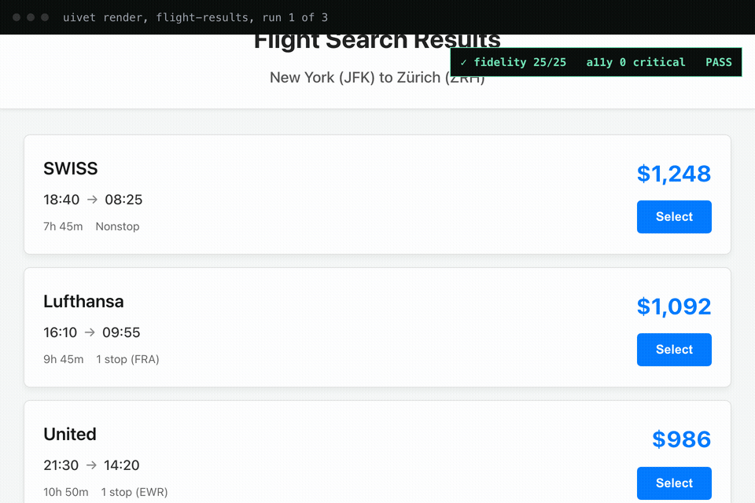
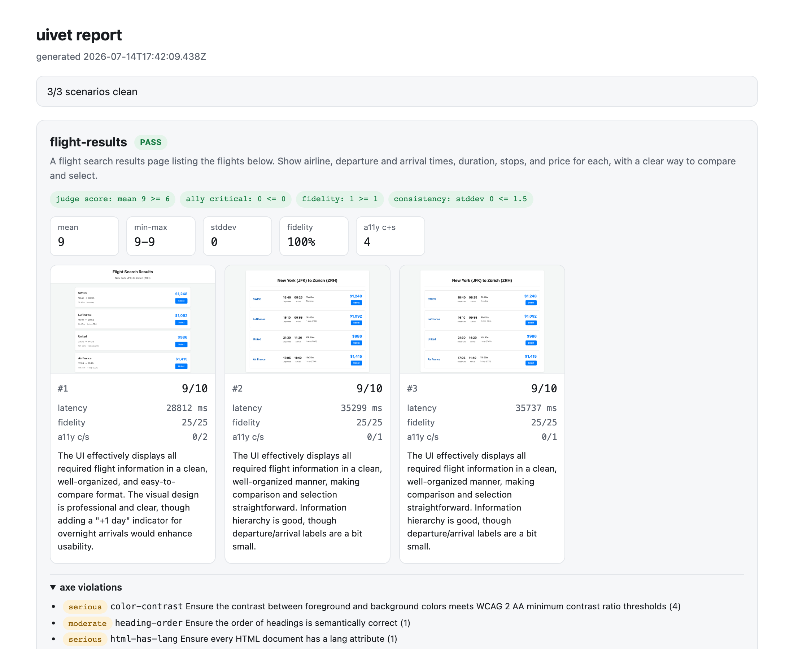

# uivet

Test and eval harness for LLM-generated UI: sample each generation N times, render it in headless Chromium, run deterministic checks plus an LLM judge, measure how consistent the outputs are, and gate the result in CI.

[](LICENSE)
[](https://github.com/MaryanPrydatko/uivet/actions/workflows/ci.yml)



Same prompt, three sampled generations. Run 3 silently dropped a price. The fidelity check caught it and failed the run.

## Try it in 30 seconds

No API key needed. This replays recorded generations from `examples/fixtures/` and runs with the judge off, so there are no network calls.

```bash
git clone https://github.com/MaryanPrydatko/uivet
cd uivet
bun install
bunx playwright install chromium
bun run demo:offline
```

It renders the recorded UIs, runs the accessibility, fidelity, layout, and console-error checks, gates on them, and writes `results/<timestamp>/report.html`. Open that file in a browser.

## Live mode

Live mode generates fresh UIs with an LLM and scores them with the multimodal judge, so it needs an API key. The default provider is Google Gemini. Set `OPENAI_API_KEY` instead to use OpenAI or any OpenAI-compatible server (see the configuration reference).

```bash
export GOOGLE_GENERATIVE_AI_API_KEY=your_key   # google (default)
# or: export OPENAI_API_KEY=your_key           # openai / openai-compatible
bun run demo
```

`bun run demo` runs the three example scenarios (flight results, expense form, metrics dashboard) three times each, generates each one, renders it, runs every check plus the judge, and writes a report.

Run your own config:

```bash
bunx uivet run --config uivet.config.ts
bunx uivet run --save-baseline        # record a baseline
bunx uivet run                        # later runs compare to it
```

Exit code is 1 if any gate fails or a regression is detected, else 0, so it drops into CI as is.

## Use it in your project

uivet is not on npm yet; install it straight from GitHub:

```bash
bun add -d github:MaryanPrydatko/uivet
bunx playwright install chromium
```

Create a `uivet.config.ts` (see the configuration reference below), then:

```bash
bunx uivet run --config uivet.config.ts
```

## Use it in CI

Add this workflow at `.github/workflows/uivet.yml`. It runs the eval on every pull request and uploads the HTML report.

```yaml
name: uivet
on: [pull_request]

jobs:
  ui-eval:
    runs-on: ubuntu-latest
    steps:
      - uses: actions/checkout@v4
      - uses: oven-sh/setup-bun@v2
      - run: bun install
      - run: bunx playwright install chromium --with-deps
      - name: Run uivet
        env:
          GOOGLE_GENERATIVE_AI_API_KEY: ${{ secrets.GOOGLE_GENERATIVE_AI_API_KEY }}
          # OPENAI_API_KEY: ${{ secrets.OPENAI_API_KEY }}  # if a config uses provider "openai"
        run: bunx uivet run --config uivet.config.ts --out ci-report
      - name: Upload report
        if: always()
        uses: actions/upload-artifact@v4
        with:
          name: uivet-report
          path: ci-report
```

A failing gate or a detected regression exits non-zero, so the `Run uivet` step fails the job. `if: always()` on the upload keeps the report available even when the gate fails. `ci-report` is the output dir set by `--out`; it holds `report.html` and `results.json`.

To gate on regressions and not only absolute thresholds, use a baseline. Record one:

```bash
bunx uivet run --config uivet.config.ts --out ci-report --save-baseline
```

That writes `baseline.json` next to the output dir (repo root, since `--out ci-report` sits at the root). Commit `baseline.json`. Later runs read it automatically. A fidelity-rate drop or a new a11y rule fails the run. A mean judge score drop of more than 1.0 is a warning only by default and does not fail the run; set `judge: { enforce: true }` to make it blocking. After an intended change, re-run with `--save-baseline` and commit the refreshed `baseline.json`.

## Links

- Sample report: https://maryanprydatko.github.io/uivet/demo-report.html
- Landing page: https://maryanprydatko.github.io/uivet/

## Leaderboard

Which LLM writes correct UI? uivet runs a fixed set of scenarios across models with deterministic checks only (judge off) and publishes pass rates: [live page](https://maryanprydatko.github.io/uivet/leaderboard.html), raw data in [leaderboard/LEADERBOARD.md](leaderboard/LEADERBOARD.md). Current top line: all three Gemini Flash models pass 5/5 scenarios at 100% data fidelity; they separate on accessibility (Gemini 3.5 Flash is cleanest at 3 serious axe violations vs 17 for Gemini 2.5 Flash) and speed (3.1 Flash-Lite generates in about 3s vs about 37s for 3.5 Flash). OpenAI models are pending an API key. Reproduce with `bun leaderboard/run.ts`.

## Why

Teams are starting to ship UI that an LLM produces at request time, and there is no test story for it. Visual regression tools assume the UI comes from deterministic code, so a fresh render that differs on every run defeats them. LLM eval frameworks judge text answers, not the pixels and DOM of a rendered interface. uivet fills that gap: it treats each generation as a sample, measures spread across samples, and checks the rendered result, not just the model output string.

## Configuration reference

The config file (default `uivet.config.ts`) default-exports a `UivetConfig`. Only `scenarios` is required; every other field has a default.

`UivetConfig`

| Field | Type | Default | Meaning |
|-------|------|---------|---------|
| `scenarios` | `Scenario[]` | required | The UIs to generate and check. |
| `generator` | `GeneratorConfig` | LLM HTML (Gemini) | How each UI is produced. |
| `judge` | `JudgeConfig` | judge on | Multimodal scoring of the render. |
| `gates` | `GatesConfig` | see below | Pass/fail thresholds. |

`Scenario`

| Field | Type | Default | Meaning |
|-------|------|---------|---------|
| `id` | `string` | required | Stable id, used in the report and baseline. |
| `prompt` | `string` | required | What the UI should do. |
| `data` | `unknown` | none | JSON the UI must display. Drives the fidelity check. |
| `runs` | `number` | `3` | Samples generated per scenario. |

`GeneratorConfig` (one of these shapes)

| Field | Type | Default | Meaning |
|-------|------|---------|---------|
| `kind: "llm-html"` | literal | default variant | Ask an LLM for a full HTML document. |
| `provider` | `"google" \| "openai"` | `"google"` | LLM provider (llm-html only). |
| `model` | `string` | provider default | Model id. Defaults: `gemini-3.5-flash` (google), `gpt-5-mini` (openai). |
| `baseUrl` | `string` | OpenAI API | Override the OpenAI base URL for any OpenAI-compatible server (openai only). The key still comes from `OPENAI_API_KEY`. |
| `kind: "gemini-html"` | literal | | Deprecated alias for `{ kind: "llm-html", provider: "google" }`. Still supported. |
| `kind: "module"` | literal | | Use your own generation code. |
| `path` | `string` | required | Path to a module exporting `generate(scenario): Promise<string>` that returns full HTML (module only). |

`JudgeConfig`

| Field | Type | Default | Meaning |
|-------|------|---------|---------|
| `mode` | `"off"` | on | `"off"` skips the judge and its two gates and makes no judge network calls. |
| `provider` | `"google" \| "openai"` | `"google"` | LLM provider that scores the screenshot. |
| `model` | `string` | provider default | Scoring model. Defaults: `gemini-3.5-flash` (google), `gpt-5-mini` (openai). |
| `baseUrl` | `string` | OpenAI API | Override the OpenAI base URL for an OpenAI-compatible server (openai only). |
| `enforce` | `boolean` | `false` | When false the two judge gates warn but do not fail the run. Set true to make them blocking. |
| `rubric` | `string[]` | task fit, usability, visual quality | Items each scored 1 to 10. |

`GatesConfig`

| Field | Type | Default | Meaning |
|-------|------|---------|---------|
| `minJudgeScore` | `number` | `6` | Min mean overall judge score (1 to 10). Advisory (warn only) unless `judge.enforce` is true. Skipped when the judge is off. |
| `maxA11yCritical` | `number` | `0` | Max critical axe violations summed across runs. Always blocking. |
| `minFidelity` | `number` | `1.0` | Min fraction of `data` values found in the rendered text. Always blocking. |
| `maxScoreStdDev` | `number` | `1.5` | Max standard deviation of judge scores across runs (consistency). Advisory (warn only) unless `judge.enforce` is true. Skipped when the judge is off. |

By default the judge is warn-only: it runs and its scores appear in the report and summary, but the judge score and consistency gates cannot fail the run, they show as amber warnings. The deterministic checks (fidelity, accessibility, layout, console) gate. This treats the judge as a smoke detector, not a lock on the door: it decides whether a human looks, not whether CI goes red. Set `judge: { enforce: true }` to make the judge gates and the mean-score regression blocking.

Set `judge: { mode: "off" }` to run with no API key: the judge and its two gates are skipped (shown as skipped in the report and summary), while the fidelity, accessibility, layout, and console checks and their gates still run and still set the exit code. Point `generator` at a `module` to use your own generation code with any model or framework, as long as it returns a full HTML document. `examples/offline-generator.ts` does this by replaying the recorded fixtures, and powers the offline demo.

## How it works

Per scenario, uivet runs a pipeline and gates the result:

1. Generate `runs` samples of the UI (default 3), each a full self-contained HTML document.
2. Render each sample in headless Chromium (Playwright, 1280x800), capturing a screenshot, the page text, and console errors.
3. Run deterministic checks on each render: data fidelity against `scenario.data`, axe-core accessibility, layout heuristics (overflow, tiny targets, empty body), and console errors.
4. Optionally score the screenshot with the multimodal judge (skipped when the judge is off).
5. Aggregate across samples: mean, min, and max judge score, score standard deviation (consistency), fidelity rate, and a11y counts.
6. Compare to `baseline.json` if present and flag regressions.
7. Evaluate every gate, write a self-contained HTML report, and exit non-zero if any gate fails or a regression is found.

The per-check specifics follow.

## How each check works

- **Generation.** For the builtin generator, uivet asks the configured LLM (Google Gemini or OpenAI) for one complete self-contained HTML document (inline CSS, no external resources) implementing the prompt for the data, and strips markdown fences if present. Generation latency is recorded per run.
- **Render.** Each document is loaded with Playwright at 1280x800 via `setContent`, waiting for network idle up to a 3s cap. uivet captures a full-page PNG, the page text, and console plus page errors.
- **Accessibility.** The axe-core source is injected into the page and `axe.run` is executed. Violations are grouped by impact; critical and serious counts feed the a11y gate.
- **Fidelity.** Every leaf string and number in `scenario.data` is collected recursively and searched for in the page text after whitespace and case normalization. Numbers also match thousands-separated variants. Fidelity is the fraction found; missing values are listed.
- **Layout.** uivet flags horizontal overflow (`scrollWidth > clientWidth`), counts interactive elements smaller than 24x24, and detects an empty body.
- **Judge.** The screenshot plus the prompt and data go to the judge model (Google Gemini or OpenAI) at temperature 0, which returns strict JSON with a 1-10 score per rubric item, an overall score, and a short rationale. One retry on a parse failure. Warn-only by default: the judge score and consistency gates surface as warnings and do not fail the run unless `judge.enforce` is true. Skipped entirely when `judge.mode` is `off`.
- **Aggregate and gate.** Per scenario uivet computes mean/min/max overall, the score standard deviation (consistency), the fidelity rate, and total critical plus serious a11y issues, then evaluates each gate.
- **Baseline.** `--save-baseline` records per-scenario mean, fidelity, and a11y rule ids. Later runs flag a regression when mean overall drops more than 1.0, the fidelity rate drops, or a new a11y rule id appears. The fidelity and a11y regressions block; the mean-score regression is a warning only unless `judge.enforce` is true.

## Output

Each run writes to `results/<timestamp>/`:

- `results.json` - every scenario, run, metric, and judge rationale.
- `report.html` - a single self-contained file (screenshots inlined) with run cards, aggregate metrics, gate chips, judge rationales, axe violations, missing fidelity values, and baseline deltas. Works in light and dark.



## FAQ

**Why not Percy or Chromatic?** Those diff screenshots against a fixed baseline and assume the UI comes from deterministic code. An LLM renders something different every run, so pixel diffing flags noise instead of real regressions. uivet samples N generations and measures the spread instead of expecting them to match.

**Why not Braintrust or Langfuse?** Those evaluate model text output and traces. uivet evaluates the rendered interface: it loads the HTML in a browser and checks the DOM, the accessibility tree, the pixels, and the console, not the output string.

**Does it work with my stack?** Anything that can emit a full HTML document works today. Point the `module` generator at your own code and return the HTML. Adapters for frameworks and structured UI protocols are welcome.

**How reliable is the LLM judge?** Treat it as a smoke detector, not the gatekeeper. The deterministic checks (fidelity, a11y, layout, console) gate. The judge runs at temperature 0 and is warn-only by default: its score and consistency gates surface as warnings and do not fail the run, because single-judge agreement on UI quality is weak. Consistency across samples and the deterministic checks carry more weight. Set `judge: { enforce: true }` if you want the judge gates to block.

**Can I use OpenAI, OpenRouter, or a local model?** Yes. Set `provider: "openai"` on the generator and/or judge and export `OPENAI_API_KEY`. The default model is `gpt-5-mini`. For any OpenAI-compatible server (OpenRouter, Ollama, LM Studio, Groq), also set `baseUrl` to its endpoint base, for example `https://openrouter.ai/api/v1` or `http://localhost:11434/v1`; the key still comes from `OPENAI_API_KEY`. Google Gemini stays the default provider and uses `GOOGLE_GENERATIVE_AI_API_KEY`.

**Can I run it without an API key?** Yes. Set `judge: { mode: "off" }` and use the `module` generator with recorded fixtures. The offline demo does exactly that, with no network calls.

## Limitations

- Single viewport (1280x800). Responsive behavior is not tested.
- Fidelity is substring matching, so a value rendered inside a larger token can register as present and formatting-only differences may pass or fail imprecisely.
- The judge is subjective. Research on UI quality rating shows designer agreement around kappa 0.25, so a single judge score is a weak signal; consistency across runs and the deterministic checks matter more.
- English only. Normalization and the judge prompt assume English text.

## Roadmap

- Schema validation for structured UI protocols (A2UI, MCP Apps) instead of only free-form HTML.
- Runtime sampling and monitoring of production generations, not just offline scenarios.
- Multi-viewport rendering and responsive checks.
- Per-team calibrated rubrics and judge ensembles to raise agreement above a single-judge baseline.

## License

MIT. See [LICENSE](LICENSE).
